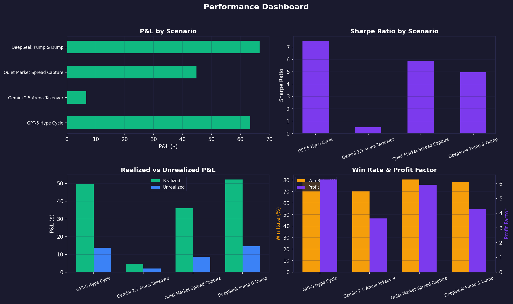
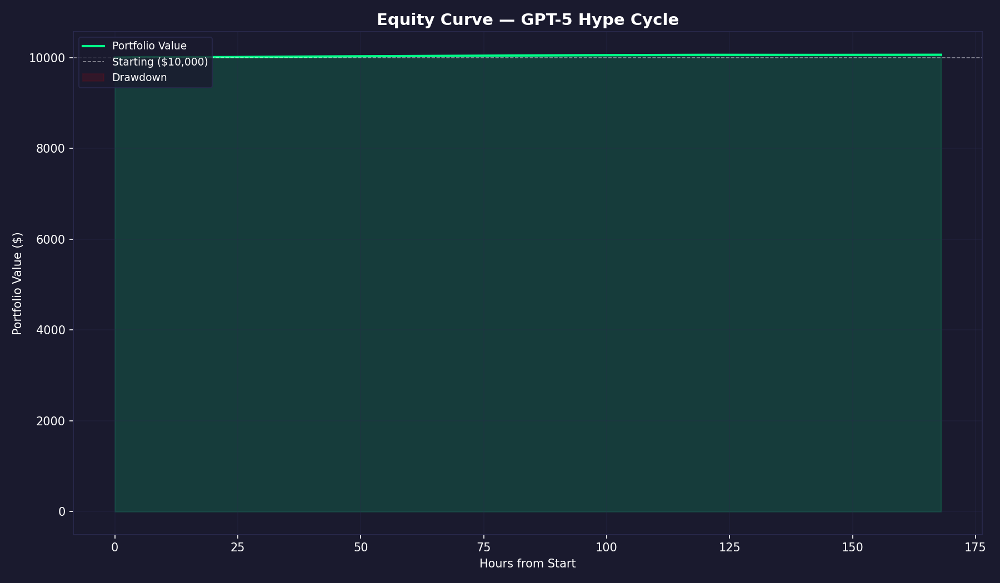
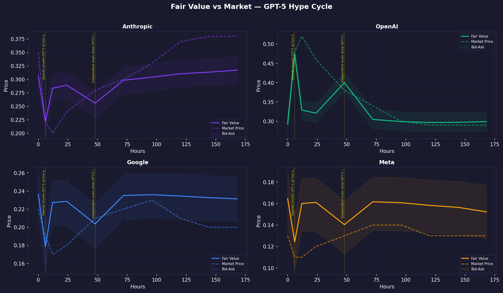
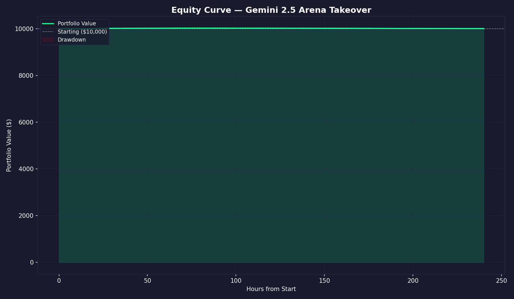
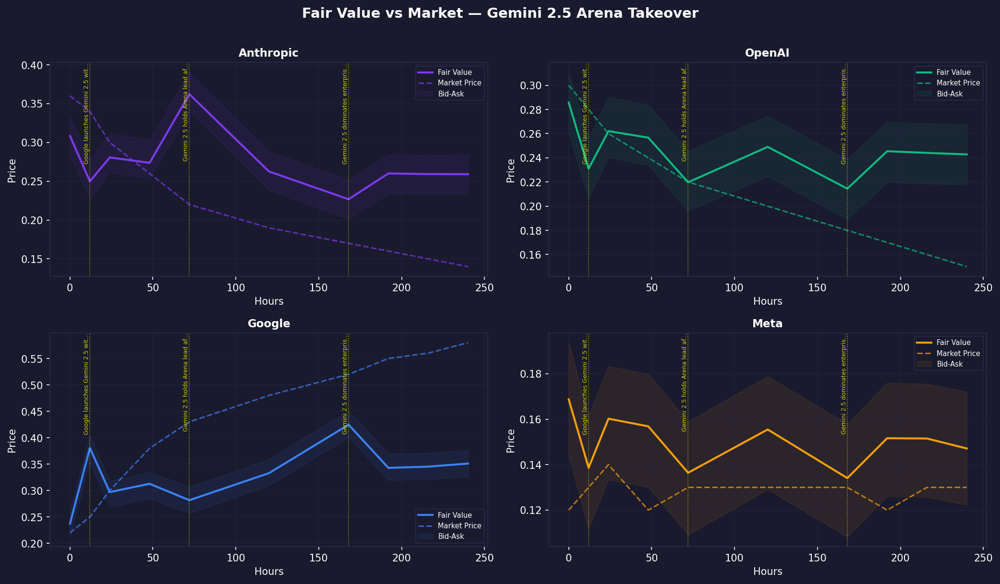
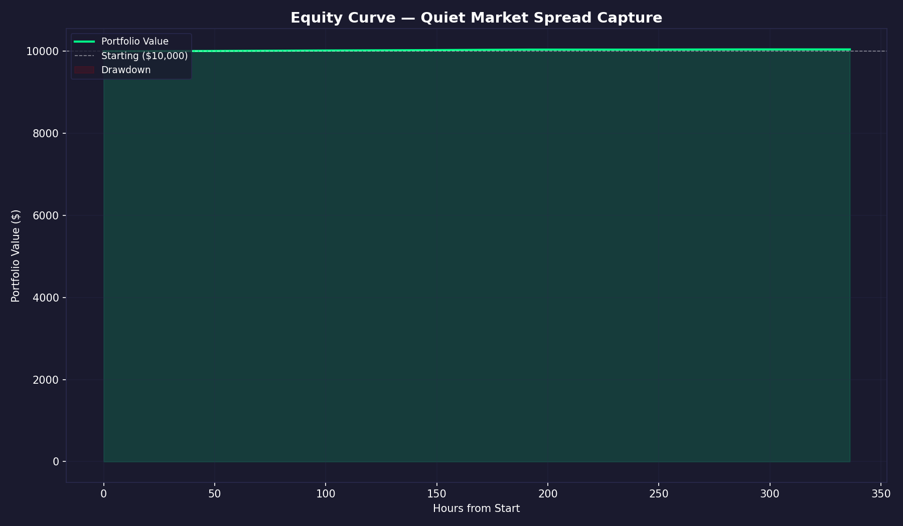
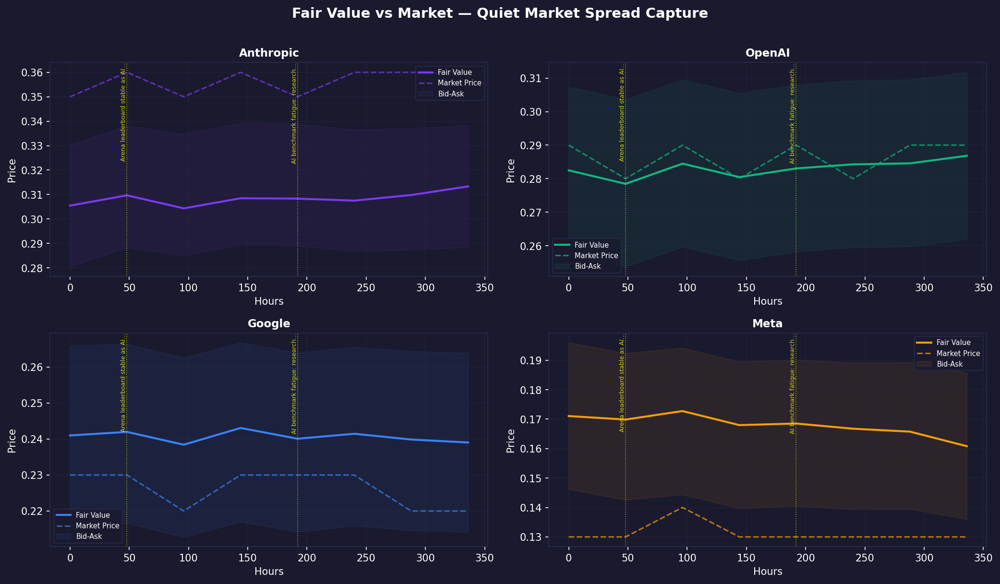
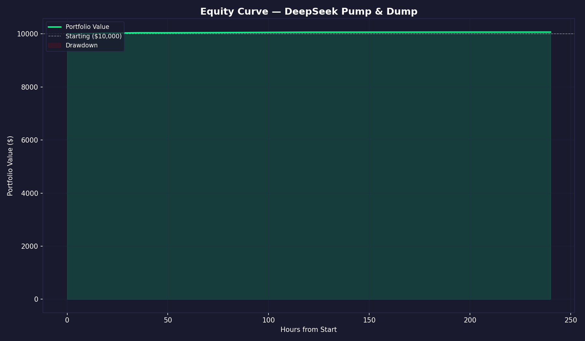
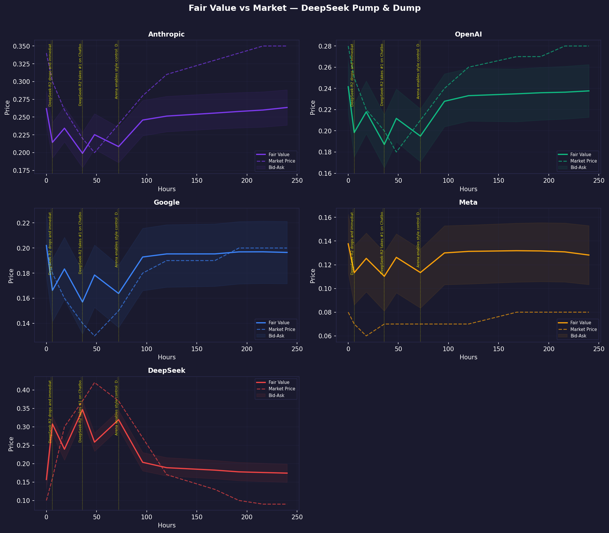
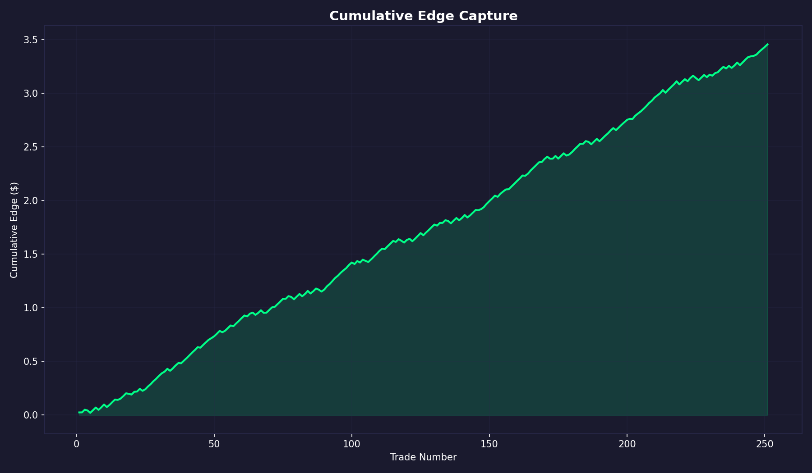

# Avellaneda-Stoikov Market Making Agent — Backtest Report

_Generated: 2026-03-28 00:47 UTC_  
_Market: Polymarket "Best AI Model" — Chatbot Arena Resolution_

## Executive Summary

| Metric | Value |
|--------|-------|
| Aggregate Return | +0.45% |
| Sharpe Ratio | 4.71 |
| Sortino Ratio | 6.43 |
| Total Trades | 251 |
| Win Rate | 77% |
| Max Drawdown | 0.2% |
| Profit Factor | 5.03 |
| Avg Edge Captured | 1.4¢ |

## Model Architecture

- **Fair Value**: Temperature-scaled softmax over Chatbot Arena ELO scores, blended with market prices
- **Signal Processing**: Bayesian likelihood ratio adjustment from news signals
- **Quoting Engine**: Avellaneda-Stoikov with inventory-adjusted reservation price
- **Parameters**: γ=0.5, κ=40.0, τ_base=150.0, σ_elo=10.0

## Scenario Results

### GPT-5 Hype Cycle
_OpenAI launches GPT-5 to massive fanfare but Arena ELO only moves 7 points. Market overreacts to 52c then corrects. Tests agent's ability to sell into hype when ELO signal disagrees with price._

| Metric | Value |
|--------|-------|
| P&L | $+63.38 |
| Return | +0.63% |
| Sharpe Ratio | 7.50 |
| Trades | 74 |
| Win Rate | 78% |
| Profit Factor | 6.28 |
| Max Drawdown | 0.0% |
| Avg Edge | 1.4¢ |

### Gemini 2.5 Arena Takeover
_Google releases Gemini 2.5 which genuinely tops Arena (ELO 1470 -> 1530). Market lags ELO signal by 3-8c throughout. Tests agent's ability to buy early when ELO signal leads price._

| Metric | Value |
|--------|-------|
| P&L | $+6.67 |
| Return | +0.07% |
| Sharpe Ratio | 0.50 |
| Trades | 57 |
| Win Rate | 70% |
| Profit Factor | 3.64 |
| Max Drawdown | 0.2% |
| Avg Edge | 1.2¢ |

### Quiet Market Spread Capture
_No major model launches for two weeks. ELOs fluctuate +/- 3 points. Market stays flat. Tests pure bid-ask spread capture profitability in a low-volatility regime._

| Metric | Value |
|--------|-------|
| P&L | $+44.79 |
| Return | +0.45% |
| Sharpe Ratio | 5.88 |
| Trades | 51 |
| Win Rate | 80% |
| Profit Factor | 5.93 |
| Max Drawdown | 0.0% |
| Avg Edge | 1.4¢ |

### DeepSeek Pump & Dump
_DeepSeek-R2 launches and briefly tops Arena via formatting tricks (ELO 1440 -> 1512). Market panics to 42c. Arena applies style control, ELO crashes to 1470. Tests agent's ability to sell into artificial spikes and profit from the collapse._

| Metric | Value |
|--------|-------|
| P&L | $+66.68 |
| Return | +0.67% |
| Sharpe Ratio | 4.95 |
| Trades | 69 |
| Win Rate | 78% |
| Profit Factor | 4.27 |
| Max Drawdown | 0.0% |
| Avg Edge | 1.4¢ |

## Cumulative Analysis

---
_Generated by Polymarket A-S Market Making Agent_